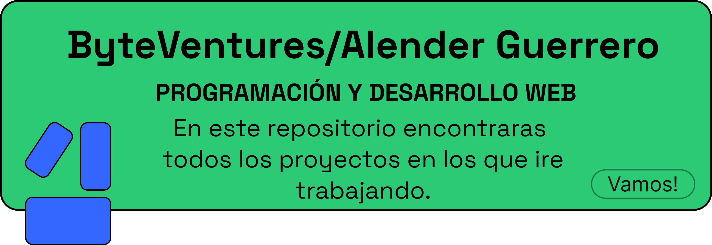

  

<h2 align="center">Bienvenidos al GitHub de Byte Ventures / Alender Guerrero</h2>

  

### Redes sociakes y mas

 

Comunidad dedicada a mostrar el proceso de guia de desarrollo web, desde los primeros pasos con HTML hasta los mas complejos, ire subiendo recursos y muchas mas cosas para compartir y aprender mas!

### Herramientas y lenguajes
 

 
 

<h3 align="center">Un apasionado por el desarrollo web, aprendiendo</h3>

 

